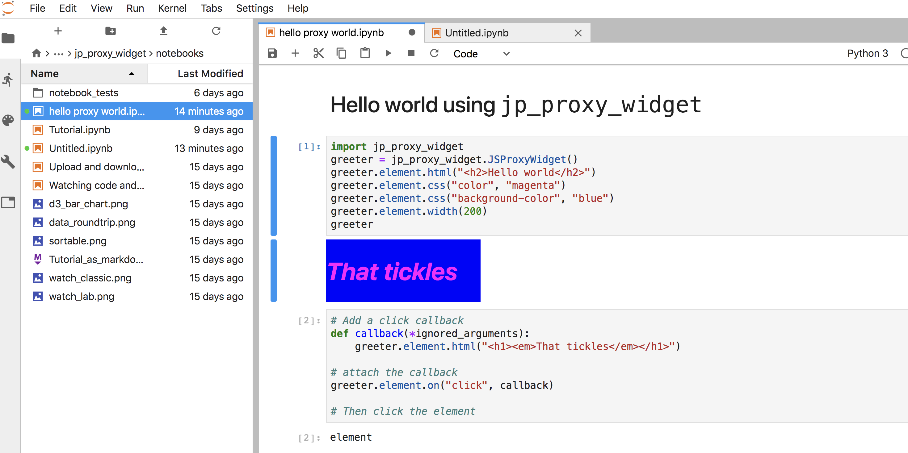

jp_proxy_widget
===============================

A generic and easy to use Jupyter/IPython widget implementation that supports
many types of javascript libraries and interactions.

Please see the
[notebooks/Tutorial.ipynb](notebooks/Tutorial.ipynb) notebook
for more information on how to use proxy widgets.
The tutorial is best viewed as a running notebook launched
by a Jupyter server.

Built in components
-------------------

The proxy widget implementation is intended to provide a framework
for building Jupyter widgets leveraging external components.
A few generally useful built in components are automatically provided.

- There is built in support for uploading and downloading files -- see
[notebooks/Upload and download widgets.ipynb](notebooks/Upload%20and%20download%20widgets.ipynb).
- The widget implementation provides built in support
for loading and using `jQueryUI` components (see the Tutorial).
- The widget implementation provides support for loading and
using the `requests.js` module management system if needed.

Other components that are not built in may be loaded using
the widget interface as described in the Tutorial.

Other examples
--------------

Other examples of `jp_proxy_widget` uses can be found in other repositories.
For example
[The `jp_doodle` repository](https://github.com/AaronWatters/jp_doodle) provideds
numerous examples of interactive components built using the proxy widget infrastructure.

Installation
------------

To install use pip:

    $ pip install jp_proxy_widget
    $ jupyter nbextension install --py --symlink --sys-prefix jp_proxy_widget
    $ jupyter nbextension enable --py --sys-prefix jp_proxy_widget

To run with Jupyter Lab

    $ jupyter labextension install @jupyter-widgets/jupyterlab-manager
    $ jupyter labextension install jp_proxy_widget

For a development installation (requires npm),

    $ git clone https://github.com/AaronWatters/jp_proxy_widget.git
    $ cd jp_proxy_widget
    $ pip install -e .
    $ jupyter nbextension install --py --symlink --sys-prefix jp_proxy_widget
    $ jupyter nbextension enable --py --sys-prefix jp_proxy_widget

For jupyterlab also do

    $ jupyter labextension install @jupyter-widgets/jupyterlab-manager .
    $ jupyter labextension install ./js
