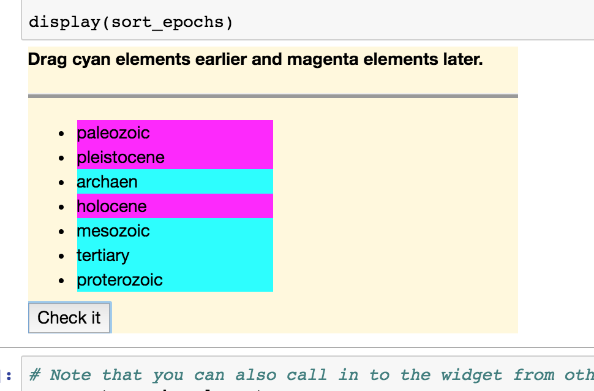
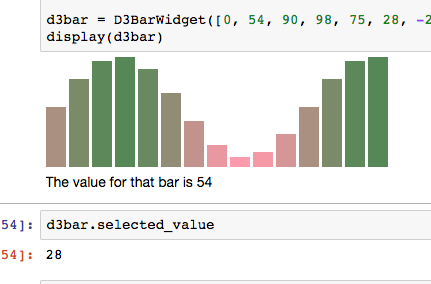
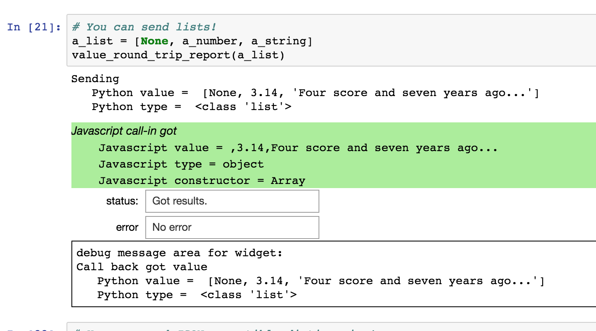

# Proxy widgets tutorial

This tutorial attempts to introduce proxy widgets and to explain their usage and major features.

The proxy widget mechanism is intended to make it easy to introduce Javascript based visualizations
and other functionality into a Jupyter notebook.   Proxy widgets support easily configurable
two way communication between Javascript components and Python components running in an IPython
kernel process.  Proxy widgets may be used to exploit thousands of useful Javascript libraries
and visualizations in Jupyter notebooks with relatively little effort.

Proxy widgets may be combined with other widget implementations to provide dynamic
and interactive methods for viewing and interacting with complex data sets.

## Tutorial organization

The tutorial follows this general outline

- Preliminary comments,
- Teaser motivational examples, not explained in detail,
- Detailed feature discussion with simpler examples,
- Discussion of proxy widget limitations and security restrictions,
- Examples of debugging aids for developing proxy widgets.

# Preliminary comments: How and Who

## Please note: the tutorial should be run interactively, one cell at a time

The tutorial does not support "offline" or "preview" mode (as discussed below) and you will
see surprising results if you use "run all" to run all the cells at once due to the asynchronous
nature of Javascript/IPython communication (also discussed below).  Please run each
cell of the tutorial independently, one at a time in order.

## Prerequisites: Who is this tutorial written for?

To develop non-trivial IPython widgets of any kind the reader will need to know
something about Python, Jupyter, HTML5, CSS, and Javascript.  It also wouldn't
hurt to have some familiarity with common Javascript libraries such a jQuery and
`require.js`.  The following discussion assumes the reader has some
familiarity with these prerequisite topics.

# Teaser widgets

## The Geological Epochs Sorting Challenge

Let's start with a teaser -- an example that is intended to illustrate
why proxy widgets are useful, but which is not fully explained in detail
or necessarily easy to understand.
In particular the presentation makes use of jQuery and jQueryUI features
without explaining them and the proxy widget mechanisms are discussed
only briefly.
More (boring and) simplified self contained examples with more detailed discussion
to illustrate specific features follow.  The teaser widget will ultimately look like
this screenshot



### Injecting the wrong epoch order as static HTML

Let's suppose we want to build a widget which tests to see whether the user
can put geological epochs in correct order by time.  Below is Python code which
creates a list with epochs in correct order and some HTML with the epochs
in an incorrect order.


```python
# Teaser example: sort geological epochs
import jp_proxy_widget

# Here are geological epochs ordered from older to younger.
epoch_order = "archaen proterozoic paleozoic mesozoic tertiary pleistocene holocene".split()

# HTML with epochs out of order:
epoch_html = """ 
<ul>
    <li data-sort-id="paleozoic">paleozoic</li>
    <li data-sort-id="pleistocene">pleistocene</li>
    <li data-sort-id="archaen">archaen</li>
    <li data-sort-id="holocene">holocene</li>
    <li data-sort-id="mesozoic">mesozoic</li>
    <li data-sort-id="tertiary">tertiary</li>
    <li data-sort-id="proterozoic">proterozoic</li>
</ul>
"""
```

Using standard IPython with no assistance from Javascript we can display the wrong order as static
HTML, but the user cannot interact with the result, as shown below.


```python
from IPython.display import HTML, display

print("Now injecting HTML...")
display(HTML("<h1 style='color:salmon'>Geological epochs in stuck in the wrong order!</h1>" + epoch_html))
```

### Making a sortable HTML list using jQueryUI `sortable`

The jQueryUI library includes methods for making a static list like the
one shown above into a `sortable` where the user can drag the list elements
into different positions.  We can use proxy widgets to use this feature to
allow the user to change the order of the elements in the list.

Below we define a function which initializes a proxy widget containing a sortable
list.  The proxy widget specific details of the mechanisms illustrated are explained in greater
detail further on.


```python
def sort_epochs_widget():
    "Make a widget for sorting the epochs."
    sort_epochs = jp_proxy_widget.JSProxyWidget()

    # Use jQueryUI (sortable):
    sort_epochs.check_jquery()

    # Configure the proxy widget with Javascript logic to show the HTML in the widget.
    sort_epochs.js_init("""
        // empty out the widget element.
        element.empty()
        
        // Add some styling
        element.css("background-color", "cornsilk").width("400px")
        
        // Append a title area for feedback.
        element.title = $("<b>Please drag the epochs to the correct order.</b>").appendTo(element);
        
        // Append a divider.
        $("<hr>").css("background-color", "#999").css("height", "3px").appendTo(element);

        // Append the initially incorrectly ordered html using jQuery.
        element.epoch_list = $(epoch_html).width("200px").appendTo(element);

        // Make the epoch list sortable using the jQueryUI sortable method
        // automatically attached to the element.epoch_list jQuery container.
        element.epoch_list.sortable()
        """, 
        # Inject the incorrectly ordered HTML from Python into Javascript.
        epoch_html=epoch_html)
    return sort_epochs

sort_epochs_no_callbacks = sort_epochs_widget()

# display the widget
display(sort_epochs_no_callbacks)
```

Although you can move the list elements to a different order there is no
provision for checking that the resulting order is the correct order of
the epochs by time.

Let's add functionality to the widget implementation by calling back to
Python from the widget when the user is ready and calling in to Javascript
to display in the widget whether the result is correct.

### Checking the list order using call-ins and call-backs

The following code is short but includes a lot of detail that may
be intimidating to the uninitiated.  It is a bit more complicated than
it needs to be in order to illustrate call-ins and call-backs together.

In general outline the code 

- defines a Python callback for checking the displayed order;
- maps the callback into Javascript for use by the widget Javascript methods;
- attaches three Javascript methods to the widget `element` that may be invoked from Python
   - one to change the background color of an item,
   - one to change the title text,
   - and one to send the display order of items back to Python using the callback; and
- appends a "check it" button to the widget connected to the Python callback.


```python
# Make a new widget and add more functionality afterwards.
sort_epochs = sort_epochs_widget()

# Use this global list to store the displayed order passed back from Javascript.
displayed_order = []

# Define a Python function to report whether the displayed order is correct.
def check_order(order):
    "Python callback: check the displayed order sent from the Widget and report results."
    # Save the order globally for debugging and reference.
    displayed_order[:] = order
    ok = True
    for (index, identifier) in enumerate(order):
        # Compare the displayed order for the identifier to the correct order in the epoch_order list.
        correct_index = epoch_order.index(identifier)
        # Default color of yellow indicates correct order.
        color = "yellow"
        if correct_index < index:
            # This identifier is displayed too early: color it cyan.
            color = "cyan"
            ok = False
        elif correct_index > index:
            # This identifier is displayed too late: color it magenta.
            color = "magenta"
            ok = False
        # colorize the element based on correct/incorrect order
        sort_epochs.element.set_color(identifier, color)
    # Also change the title text, as appropriate.
    if ok:
        # No out of order elements found.
        sort_epochs.element.set_title("The order is correct!")
    else:
        # Display list is out of order: give the user a hint in the title.
        sort_epochs.element.set_title("Please drag cyan elements earlier and magenta elements later.")

# Add more Javascript logic to the proxy widget, defining call-ins and using the callback.
sort_epochs.js_init("""

        // Attach a  Javascript function to change the background color of a list element.
        element.set_color = function(id, color) {
            // jQuery magic to find the element that matches the identifier.
            element.find("[data-sort-id=" + id + "]").css("background-color", color)
        };
        
        // Attach a Javascript function to change the title
        element.set_title = function(text) {
            element.title.html("<b>" + text + "</b>");
        };
        
        // Attach a Javascript function to report the displayed order back to the Python callback check_order:
        element.report_order = function() {
            // jQuery magic to get the sort order array.
            var display_order = element.epoch_list.sortable("toArray", {"attribute": "data-sort-id"});
            // call back to Python to report the display order
            check_order(display_order);
        };
        
        // Append a check button linked to the Python callback
        $('<button type="button">Check it</button>').click(element.report_order).appendTo(element);
        
    """, 
    # Bind the Python callback in to the Javascript context.
    check_order=check_order)

# show the resulting widget
display(sort_epochs)
```


```python
# Note that you can also call in to the widget from other Python code.
e = sort_epochs.element
e.set_title("The geological epoch game!")
e.set_color("paleozoic", "pink")
```

## Another teaser: a color interpolated animated bar chart using `d3`

Although the "Epoch order challenge" illustrates many features of proxy widgets,
it is not very visually exciting.  Below is a bar chart implemented using a proxy
widget that uses `d3`. Here is a screen shot of the widget.



The bar chart implementation includes color interpolation and mouse-over animations.
The widget uses `require.js` to load `d3` from a remote CDN (and thus may not work
if the browser doesn't have good internet access).
It is presented without further explanation.


```python

class D3BarWidget(jp_proxy_widget.JSProxyWidget):
    
    is_ready = False
    
    def __init__(self, data, *pargs, **kwargs):
        super(D3BarWidget, self).__init__(*pargs, **kwargs)
        self.data = data
        self.selected_value = None
        self.uses_require(self.make_barchart)
        
    def make_barchart(self):
        self.js_init("""
        
        debugger;
        
        // configure d3 for remote loading from cloudfare
        element.requirejs.config({
          paths: {
              d3: '//cdnjs.cloudflare.com/ajax/libs/d3/3.4.8/d3.min'
          }
        });
        
        // useful calculations over data array injected by Python
        var min_data = Math.min(...data);
        var max_data = Math.max(...data);
        var epsilon = 0.01;
        var data_span = 2 * epsilon + max_data - min_data;
        var max_height = 100;
        var data_height = function (d) {
            return Math.round(max_height *(0.1 + (d - min_data) / data_span));
        }
        
        // clear the element
        element.empty();
        
        // Append a target for the bar chart.
        var target = $("<div/>").appendTo(element);
        
        // Append a title under the bar chart.
        var title = $("<div>Bar Chart</div>").appendTo(element);
        
        // Change title call-in
        element.change_title = function (text) {
            title.html("<div>" + text + "</div>");
        };
        
        // Use require to asynchronously load the "d3" module.
        element.requirejs(["d3"], function(d3) {
            // color interpolation logic:
            var interpolator = d3.interpolateRgb(
                                  d3.rgb('#ff99aa'),
                                  d3.rgb('#558855')
                                );
            var get_color = function(d) {
                return interpolator((d - min_data + epsilon)/data_span)
            };
            // mouse event logic:
            var mouse_enter = function(d) {
                // Call back to inform Python of the selection
                select_value(d);
                // Animate the selected bar bigger and a different color
                d3.select(this)
                .transition()
                .style("width", "40px")
                //.style("height", 2 * data_height(d) + "px")
                .style("background-color", get_color(max_data-(d-min_data)));
            };
            var mouse_leave = function(d) {
                d3.select(this)
                .transition()
                .style("width", "20px")
                //.style("height", data_height(d) + "px")
                .style("background-color", get_color(d));
            };
            
            // Initialize the bar chart
            d3.select(target[0])
              .selectAll("div")
              .data(data)
              .enter()
              .append("div")
              .style("display", "inline-block")
              .style("background", (d)=> get_color(d))
              .on("mouseenter", mouse_enter)
              .on("mouseleave", mouse_leave)
              .style("width", "20px")
              .style("margin-right", "3px")
              .style("height", (d)=> data_height(d) + "px");
            ready();
        });
        """, 
        # Map Python values and callbacks into the Javascript namespace,
        ready=self.ready, data=self.data, select_value=self.select_value)
        
    def ready(self):
        self.is_ready = True
        self.element.change_title("Please mouse over the bars in the bar chart.")
        
    def select_value(self, value):
        self.selected_value = value
        self.element.change_title("The value for that bar is " + repr(value))
        

d3bar = D3BarWidget([0, 54, 90, 98, 75, 28, -28, -75, -99, -90, -53, 0, 54, 91, 98])
display(d3bar)
```


```python
d3bar.selected_value
```

I hope that somewhat complex preliminary motivated that proxy widgets provide
an interesting way to use a Javascript libraries like `jQueryUI` and `d3`
to build interactive widgets in an IPython notebooks.

Now let's look at proxy widgets and their features in greater detail
using simpler examples.

# Some basic features of proxy widgets

Here is an overview of the features of proxy widgets discussed using
smaller examples below.

- Proxy widgets are focused around the jQuery `element` associated to the widget.
- Proxy widgets allow Python to call-in to Javascript.
- Proxy widgets allow Javascript to call back to Python.
- Python/Javascript interactions for widgets (including proxy widgets) are asynchronous.
- Proxy widgets allow Python to send JSON compatible data to Javascript (with extensions).
- Proxy widgets allow Javascript to send JSON compatible data to Python up to a specified recursion limit.
- Proxy widgets can load CSS styles.
- Proxy widgets can load vanilla Javascript libraries.
- Proxy widgets can load AMD Javascript modules designed to be managed by require.js

## Some proxy widget limitations and the security imperative

Proxy widgets have limitations and they do not do everything that can be implemented using
full blown widgets.  We will also discuss the following limitations.

- The order of execution between cells and javascript fragments can be confusing.
- Proxy widgets are not designed to work in offline mode
- Proxy widgets are not designed to provide a "preview" when a notebook is first openned but no cells are executed.
- Proxy widgets are not designed to support "multiple views" of the same widget instance.

Some of the limitations are a consequence of the following **security imperative**:

> A proxy widget will **never automatically execute code** before the notebook cell
> constructing the widget is explicitly executed.

This means that you can open and preview a notebook containing proxy widgets and the
proxy widgets will not have any effects until you execute the cells that define the widgets.

This security imperative is discussed in greater detail below.


# Feature examples

## Proxy widgets are focused around the jQuery `element` associated to the widget.

All widgets are associated with an HTML DOM (Document Object Model) object
that is displayed on the page and anchors the widget which is referred to
by proxy widget implementations as the `element`.  The proxy widget element
is actually not the DOM object itself, but it is a jQuery wrapper containing
the DOM object.

Proxy widgets have a `js_init` method (which may be called any number of times)
which injects Javascript code for configuring the Proxy widget.  The
`js_init` provides the variable `element` which refers to jQuery DOM object wrapper
associated with the widget.

Code in `js_init` may attach functions or other objects to the `element` for
later reference.

The `element` is also available directly in Python code via a facade object
`widget.element`.  The `widget.element` may be used to call callables attached
to the element associated with the widget.  For example below we use
`demo0.element.width("300px")` from Python to call the `jQuery.width` method
which changes the width of the widget element and we use
`demo0.element.change_text("...")` in Python to invoke a function attached 
in `js_init` to the element which changes the HTML text of the element.


```python
# Python code here to create the widget

demo0 = jp_proxy_widget.JSProxyWidget()

demo0.js_init("""

// Injected Javascript here to initialize the widget presentation.

// In js_init the "element" jQuery object is always bound to the widget "anchor".
// The element is a jQuery object equipped with standard jQuery methods and any
// extension methods which have been injected into jQuery.
// The DOM object associated with the widget is contained in the element
// as element[0].

// Empty out the default content of the element.
element.empty();

// Put some helpful text in the widget
element.html("<div><b>The element is right here where the bold text shows up!</b></div>");

// You can also attach functions and other objects to the element by name for use later:
element.change_text = function(text) {
    element.html("<div><em>" + text + "</em></div>")
}

""")

# display the widget
display(demo0)
```


```python
# From Python the element is emulated as "widget.element" -- use this handle to call methods of the element.

# Change some styles using jQuery methods:
demo0.element.css("background-color", "cyan")
demo0.element.width("300px")

# Call the change_text function attached to the element above in js_init.
demo0.element.change_text("Help! Help! I'm being repressed!")
```

## Proxy widgets allow Python to call-in to Javascript.

We have seen above several examples of Python calling Javascript via
the `widget.element` facade object.  Although there are other ways to
invoke Javascript code not documented in this tutorial it is most convenient
to call functions or methods directly attached to the `element` in this
manner.  Below we configure a widget using only standard `jQuery` methods
pre-defined for the `element`.  Other callables can be attached to
the `element` using `js_init` and called from Python via `widget.element`
as shown in the previous example.


```python
demo_call = jp_proxy_widget.JSProxyWidget()

# Shorthand:
e = demo_call.element

# Call some standard jQuery method on the widget element:
e.empty()
e.html("<div>Demonstration of calling from Python to Javascript</div>")
e.css("background-color", "#badcad")
e.width("200px")
e.height("100px")

# display the widget
display(demo_call)
```


```python
# The methods may be called after initialization too any number of
# times (for example in response to interactive events).
e.css("color", "#d1b")
```

## Proxy widgets allow Javascript to call back to Python (asynchronously).

You can use `js_init` to bind Javascript variables to Python call backs
which can be called from Javascript.  The Python callables are most useful
for responding to Javascript events by updating data structures or
triggering changes to the widget that require information available to the Python
kernel.

As discussed below the callbacks run asynchronously and things like `print` 
and raised exceptoins do
not behave "normally".  Proxy widgets provide a `debugging_display` helper method
which captures print output and exceptions from callbacks as illustrated below.


```python
def printing_callback(*args):
    print("received: ", args)
    
demo_callback = jp_proxy_widget.JSProxyWidget()
demo_callback.js_init("""
element.html("<div>Proxy widget sending:</div>").css("background-color", "#9ce").width("400px");

// Create a function which uses the callback
var send = function(text) {
    $("<pre>    " + text + "</pre>").appendTo(element);
    callback(text);
};

// Send some stuff
send("Never gonna give you up");
send("Never gonna let you down");
send("Never gonna run around and desert you");
""", callback=printing_callback)

# Capture prints from the printing_callback with the help of debugging_display:
demo_callback.debugging_display()
```

## Python/Javascript interactions for widgets (including proxy widgets) are asynchronous.

One of the confusing aspects of widget programming in general is the asynchronous
nature of the communication between the Python kernel and the Javascript front end.
Essentially all communication is effected by one way messages.  This means that when
Python commands Javascript to do something the Python kernel is never informed when
the operation is complete (directly).  Similary when Javascript calls back to the Python
kernel the Javascript code does not directly know when the call back has completed.
In many cases the "other side" may not even be sure when a message has arrived and
an operation has started either.

If we use `request.js` to asynchronously loaded Javascript modules there is yet another
layer of asynchronicity at play.  This can make programming widgets confusing and tricky.

In general if a widget implementation 
requires execution ordering constraints between
fragments of Javascript and fragments of Python, the implementation may need to
build in some sort of explicit signalling.  This is a general
issue for all widget implementations not specific to proxy widgets.

*Warning:* Python `time.sleep(x)` freezes the Python interpreter and 
`IPython.get_ipython().kernel.do_one_iteration()` causes cells to execute out of order
and other anomalies.  I've found they 
are usually not helpful for addressing synchronization issues.

### Async example anomaly

For example the following proxy widget implementation immediately calls back
to Python when the widget is initialized.  However since the widget initialization
does not complete until after the code cell has executed, the code cell does not see
any side effects of the callback (since it hasn't happened yet).  This kind of
thing can be surprising if you have no insight into the underlying communication
mechanism.

If you run these cells using "Run All" then the callback will not execute until
all the cells of the notebook have completed (which I consider a misfeature) so
even the following cells will not see side effects from the call back.


```python
demo_async = jp_proxy_widget.JSProxyWidget()

# store callback results here:
async_info = []

def callback_async(*args):
    "Python callback: Store the arguments globally for inspection later."
    async_info[:] = args
    
demo_async.js_init("""

// Put some text in the widget and add a CSS class too.
element.html("<div>Demonstration of async behavior</div>")
   .addClass("no-such-class-is-defined-I-think")
   .css("background-color", "#dc9").width("200px");

// Call back to python with the class string
// -- but it won't happen until *after* the cell has executed
callback_async(element.attr("class"))

$("<div><b>I called the call back!</b></div>").appendTo(element)

""", callback_async=callback_async)

# display the widget
display(demo_async)

# print the stored arguments (there won't be any!)
print("Right after displaying the widget in the same cell async info is", async_info)
print("because the callback will execute asynchronously later.")
```


```python
# If you are running the cells by hand then when you execute this cell 
# the call back value will have arrived.

# However if you do a "run all cells" then the value won't arrive until *all* the cells
# in the notebook have executed.

print("But in the next cell async info is", async_info)
if not async_info:
    print ("Are you running this cell interactively?  I think not.")
```

## Proxy widgets allow Python to send JSON compatible data to Javascript (with extensions).

Proxy widgets send data back and forth between Python kernels and Javascript interpreters using
JSON encoded packets.  The following helper uses the `debugging_display` of a proxy widget to illustrate
values sent by Python, values received by Javascript, and values passed back from Javascript to Python.



The `debugging_display` uses a composite widget to capture prints and exceptions generated
by widget callbacks.  The following code defines the helper widget factory -- we do not explain the
factory implementation in detail here.


```python
# The tutorial uses the helper logic in this cell but does not discuss
# the workings of the logic in detail.

# The helper code sends a value from Python to Javascript and back
# and displays information about the value at each transition.

def print_value_report(title, value):
    "Print some useful information about a data value."
    print(title)
    print("   Python value = ", repr(value))
    print("   Python type = ", repr(type(value)))

def value_round_trip_report(value):
    "Make a widget to display information about sending a value to and from Javascript to Python."
    print_value_report("Sending", value)
    w = jp_proxy_widget.JSProxyWidget()
    
    w.js_init("""
    
    // "Print" information on the value received by Javascript.
    element.html("<div><em>Javascript call-in got</em></div>").css("background-color", "#ae9");
    
    $("<pre>    Javascript value = " + value + "</pre>").appendTo(element);
    
    var value_type = typeof value;
    $("<pre>    Javascript type = " + value_type + "</pre>").appendTo(element);
    
    try {
        var value_constructor = value.constructor.name;
        $("<pre>    Javascript constructor = " + value_constructor + "</pre>").appendTo(element);
    } catch (err) {
        $("<pre>    No Javascript constructor</pre>").appendTo(element);
    }
    
    // Call back to Python to see what value gets sent back.
    report_callback("Call back got value", value);
    
    """, value=value, report_callback=print_value_report)
    
    display(w.debugging_display())
```

## Sending values back and forth

Using the `value_round_trip` helper defined in the previous cell, let's examine how various kinds of
values move back and forth between the Python kernal and the Javascript interpreter.


```python
# You can send strings!
a_string = "Four score and seven years ago..."
value_round_trip_report(a_string)
```


```python
# You can send numbers!
a_number = 3.14
value_round_trip_report(a_number)
```


```python
# You can send None!
value_round_trip_report(None)
```


```python
# You can send lists!
a_list = [None, a_number, a_string]
value_round_trip_report(a_list)
```


```python
# You can send JSON compatible dictionaries!
a_dict = {"str": a_string, "float": a_number, "None": None, "list": a_list}
value_round_trip_report(a_dict)
```

### Sending binary data

You can send binary data from Python to Javascript using Python `bytearrays`.
The binary data will show up on the Javascript side as a `Uint8Array` with the
same bytes as content.

You can send binary data from Javascript to Python using `Uint8Array`s but the
corresponding value will show up on the Python side as a hex-encoded string.
The `jp_proxy_widget.hex_codec.hex_to_binary(hex_string)` convenience function
converts a hex encoded string to a Python `bytearray`.


```python
binary_in = bytearray(range(10))
value_round_trip_report(binary_in)
```


```python
# The call back "binary" value above is the hex encoded string:
hex_string = '00010203040506070809'

# Convert it back to real binary thus:
from jp_proxy_widget.hex_codec import hex_to_bytearray
(binary_in, hex_to_bytearray(hex_string))
```

## Proxy widgets allow Javascript to send JSON compatible data to Python up to a specified recursion limit.

The code to convert Javascript values for sending to the Python kernel uses
simple recursive descent and does not test for shared or cyclic structures.
In order to prevent infinite loops and to reduce the likelihood of exponential
data structure sizes there is a `callable_level` depth cutoff to truncate the
recursion.

In some cases widget implementations may need to increase the
`callable_level` (which defaults to 3) in order to send deeper structures
to Python.  The example below increases the level to 5.

The widget below creates a cyclic (self referential) data structure and passes
the value back to Python in a callback.  The Python callback receives the "unravelled"
structure truncated at the 5th recursion.  In this case simple recursive descent
with no depth limit (or other sanity check) would result in an infinite recursion.


```python
demo_recursion_limit = jp_proxy_widget.JSProxyWidget()

recursion_data = []

def recursion_callback(*args):
    recursion_data[:] = args
    
demo_recursion_limit.js_init("""
var self_loop_object = {"simple_value": 100};

// make a self referential loop
self_loop_object["self_loop"] = self_loop_object

element.html("Calling back with an 'infinite' object ;c)");

recursion_callback(self_loop_object)

""", recursion_callback=recursion_callback, callable_level=5)

display(demo_recursion_limit)
```


```python
if not recursion_data:
    print ("Please run this cell interactively.")
else:
    print ("Here the cyclic structure sent from Javascript is unravelled but truncated 5 levels deep:")
recursion_data
```

## Proxy widgets can load CSS styles.

The proxy widget implementation is intended to support the use of Javascript
libraries in Jupyter even when the libraries have not been designed for use in Jupyter.
Often external libraries require support from CSS style definitions.

The proxy widget API includes methods for loading external CSS files by 
file path or by URL.

### `jp_proxy_widget` "vendor" files

The `jp_proxy_widget` module includes a number of supporting Javascript
and CSS files.  If a file path is not found in the usual way, the proxy
widget implementation will try to find it in the vendor area.

To demonstrate the loading of CSS files we load `js/simple.css` from the
vendor area.  First we examine the file content and then we load and use
the CSS styles.


```python
from jp_proxy_widget import js_context
style_fn="js/simple.css"
print(js_context.get_text_from_file_name(style_fn))
```


```python
loadCSS = jp_proxy_widget.JSProxyWidget()

# load the CSS file (just once per page).
loadCSS.load_css(style_fn)

loadCSS.js_init("""
element.html('<div><em class="random-style-for-testing">Styled widget element.</em></div>')
""")
display(loadCSS)
```

## Proxy widgets can load vanilla Javascript libraries.

Proxy widgets are intended to be used with external Javascript libraries.
If the external library is a "stand alone vanilla Javascript library" which
does not require the use of loader like `require.js` or some other loader
a widget may load the library using `load_js_files` as shown below.

First we examine a demo vanilla javascript file
from the vendor area and then we show
a proxy widget which loads and uses the loaded javascript side effects.


```python
js_fn="js/simple.js"
print(js_context.get_text_from_file_name(js_fn))
```


```python
loadJS = jp_proxy_widget.JSProxyWidget()

loadJSinfo = {}

def answer_callback(answer):
    loadJSinfo["answer"] = answer

# load the file
loadJS.load_js_files([js_fn])


loadJS.js_init("""
    element.html('<b>The answer is ' + window.the_answer + '</b>')
    answer_callback(window.the_answer);
""", answer_callback=answer_callback)

display(loadJS)
```


```python
if not loadJSinfo:
    print ("Please run this cell interactively!")
loadJSinfo
```

## Proxy widgets can load AMD Javascript modules designed to be managed by require.js

Some "anonymous" Javascript libraries are designed to have no automatic side effects in the
environment and must be loaded by a loader.  The proxy widget implementation includes built
in support for modules designed to be managed by the `require.js` loader.

Below is an example anonymous module from the vendor area:


```python
require_fn="js/simple_define.js"
print(js_context.get_text_from_file_name(require_fn))
```

The proxy widget below makes sure `require.js` is available and loads the example module.


```python
requireJS = jp_proxy_widget.JSProxyWidget()

module_identifier = "three_primes"

# Associate the module with the module_identifier
requireJS.require_js(module_identifier, require_fn)

# Initialize the element using code that requires the loaded module using the identifier.
requireJS.js_init("""
console.log("js init calling requirejs " + module_identifier);

element.html("<em>loading " + module_identifier + "</em>");
element.css("background-color", "#ea9")

element.requirejs([module_identifier], function(module_value) {
    console.log("js init using value for " + module_identifier);

    $('<div><b>First three primes: ' + module_value.first_3_primes + '</b></div>')
       .css("background-color", "#9ea").appendTo(element);
});
""", module_identifier=module_identifier)

display(requireJS)
```

As shown in the bar `d3` bar chart example above a `js_init`
invocation can configure `require`
to load Javascript libraries from remote web locations, for example like this
```javascript
        // configure d3 (in js_init)
        element.requirejs.config({
          paths: {
              d3: '//cdnjs.cloudflare.com/ajax/libs/d3/3.4.8/d3.min'
          }
        });
```
Please see the 
[Require documentation at http://requirejs.org/docs/api.html](http://requirejs.org/docs/api.html)
for more information on how to configure `require.js`.

# Proxy widget limitations

Widget development is tricky and proxy widgets are not intended to support all the features
which are available to full blown widget implementaions.  Below we discuss some of the issues
and limitations of proxy widgets.

## The order of execution between cells and javascript fragments can be confusing.

When you combine the asynchronous nature of widget communications with other asynchronous libraries
such as `require.js` you can easily get into synchronization problems.  For example a
Python side widget implementation
may attempt to call a Javascript function before the function has been defined.

The following example shows a technique that makes sure the widget Javascript is fully
initialized before the Python implementation attempts to interact with Javascript functions.
The trick is to use a `ready` callback which is called by the Javascript initialization code
when the widget is fully initialized.

If we modify the implementation to call the `self.ready()` method immediately in `self.__init__`
the widget will fail because the `make_save_button` javascript function will not be defined
before it is called from Python.


```python
class SaverWidget(jp_proxy_widget.JSProxyWidget):
    
    def __init__(self, *pargs, **kwargs):
        super(SaverWidget, self).__init__(*pargs, **kwargs)
        # Bind the "FileSaver" AMD library.
        self.require_js("saveAs", "js/FileSaver.js")
        # Initialize the widget using they asynchronously loaded "saveAs" module
        self.js_init("""
        // Use require to asynchronously load the "saveAs" module.
        element.requirejs(["saveAs"], function(saveAs) {
        
            // Define a function to create a "save filename" button.
            // Python better not try to call this function before it's defined!
            element.make_save_button = function(text, name, type) {
            
                // When the user clicks, download the file content using the name and type.
                var save_click = function() {
                    var blob = new Blob([text], {type: type});
                    saveAs(blob, name);
                };
                
                // Give the user a button to click.
                element.html("<button>Save file " + name + "</button>").click(save_click)
            };
            
            // OK: now the widget is initialized and ready!
            ready();
            
        });
        """, ready=self.ready)
        
    def ready(self):
        "Make a button to download a small text file."
        # This won't work unless make_save_button is defined first!
        self.element.make_save_button("small text content", "small_file_download.txt", "text/plain;charset=utf-8")

print ("Warning -- if you click the button a file will download to your download area!")
display(SaverWidget())
```

## Proxy widgets are not designed to support "multiple views" of the same widget instance.

Widgets can support multiple views where the same "widget model" can have several
"view presentations" which behave the same.  The implementation of multiple views
requires the Python side of the widget implementation to replicate all state information
kept on the Javascript side so that the state for a new view can be replicated to
match existing views.

Proxy widgets are intended to work with arbitrary Javascript libraries and it is
not feasible to replicate the internal state information generically for any possible library
implementation.
Consequently multiple views for proxy widgets do not work.

For example if we create a proxy widget and display it twice
the second view will say `Uninitialized Proxy Widget`.


```python
view_me = sort_epochs_widget()

# The first view works.
display(view_me)
```


```python
# The second view doesn't work
display(view_me)
```

# Security Imperative: *No Automatic Execution*

In the Jupyter world the code encapsulated in a Jupyter notebook cell can
do anything the underlying language kernel can do.  **The user is responsible
for making sure a notebook cell will not accidentally or maliciously do something
harmful when the user explicitly executes the cell.**

However when the user opens a notebook the user does not have control of what
the notebook does **automatically** before cells are explicitly executed.

To prevent proxy widgets from automatically performing actions before the
user has explicitly executed the cells containing the proxy widgets the
proxy widget implementation follows the following **security imperative**:

> A proxy widget will **never automatically execute code** before the notebook cell
> constructing the widget is explicitly executed.

To prevent proxy widgets from performing automatic actions before the cell
which constructs the widget is executed some IPython widget optional features
are disabled or not implemented.


## Proxy widgets are not designed to work in offline mode

In general IPython widgets can include features to support viewing widget
output outside of the Jupyter server context when there is no IPython kernel
running in the back end.  To implement this for proxy widgets the implementation
would need to store arbitrary Javascript hidden in internal
structures inside the notebook.  That would be
a potential violation of the security imperative and for that reason this
feature is not implemented.

## Proxy widgets are not designed to provide a "preview" when a notebook is first opened but no cells are executed.

The preview feature for proxy widgets would require the automatic execution
of Javascript before cells have executed.  That would be a violation of the
security imperative so this feature is not supported.

# Debugging aides and tricks

The proxy widget implementation includes a number of tools to help with debugging widget
implementations.  

## `debugging_display`

Below we create a proxy widget with bugs and use the 
`debugging_display` method to capture error information when the widget
displays.


```python
javascript_syntax_error = jp_proxy_widget.JSProxyWidget()
javascript_syntax_error.js_init("this is a not valid javascript")
display(javascript_syntax_error.debugging_display())
```

Note that although the debugging display tells us we have a SyntaxError it doesn't
say where the SyntaxError is in the string, which can be a problem if the Javascript
code string is long.  One way to find syntax errors I use is to paste the offending
string into the Chrome browser Javascript console.  Sometimes the syntax highlighting
makes the problem obvious.  Other times I mess with the string in the console until the
syntax complaint goes away.

If the javascript code string is too long then consider breaking it out into
an external javascript file.

## `print_status`

Another way to examine a widget that may have encountered an error is to use
the `print_status` method of the widget which prints internal state information
for the widget which may be useful for debugging.


```python
if not javascript_syntax_error.error_msg:
    print("Please run this cell interactively.")
else:
    javascript_syntax_error.print_status()
```

## Python callback exceptions

Without special treatment exceptions that occur in Python callbacks "disappear",
but the `debugging_display` will capture them.

Below we define a widget with a broken callback function and we display the result using
`debugging_display`.


```python
py_div_0 = jp_proxy_widget.JSProxyWidget()

def div_0_callback(value):
    "This won't work."
    zero = 0
    the_result = value/zero
    py_div_0.element.set_title("the value divided by 0 is " + repr(the_result))
    
py_div_0.js_init("""
    element.html("<div>Calling back to python with the value 10.3</div>")
    value_callback(10.3)
    
    element.set_title = function(text) {
        element.html("<div>"+text+"</div>");
    }
    """, value_callback=div_0_callback)

display(py_div_0.debugging_display())
```

## `js_debug`

In Chrome if you open "Developer tools" you can use the proxy widget `js_debug` method
to break into the debugger to examine the element and possibly call its methods.

For example here is a widget with a Javascript name error issue.


```python
js_name_error = jp_proxy_widget.JSProxyWidget()
js_name_error.js_init("""
element.html("<b>Please call my element.name_error() method!</b>");

element.name_error = function() {
    this_function_does_not_exist(1,2,3);
};
""")
display(js_name_error)
```


```python
js_name_error.element.name_error()
```


```python
# Now to see the problem in the debugger, open "Developer tools" in Chrome and then execute
# this cell:

js_name_error.js_debug();

# then in the javascript console you should be able to directly call
# element.name_error()
# and see the exception in the debugger interface

# If developer tools is not open the above invocation should have no effect.
```

# Tutorial recap

This tutorial was an introduction to proxy widgets.  It covered

- The recommended prerequisite background for implementing proxy widgets.
- A couple motivating examples not explained in great detail.
- The basic features and concepts of proxy widgets
    - the `element`,
    - Python calling in to Javascript,
    - Javascript calling back to Python,
    - the asynchronous nature of widget programming,
    - data transfers between Python to Javascript and back,
    - special consideration for binary data,
    - the javascript data recursion limit,
    - loading CSS styles using a proxy widget,
    - loading vanilla Javascript using a proxy widget,
    - loading anonymous AMD Javascript modules using a proxy widget,
- Proxy widget limitations and security restrictions.
- Some built in debugging tools to help with developing proxy widgets.
    
Please post corrections, suggestions, and constructive criticisms
at the 
[github issues area for `jp_proxy_widgets`](https://github.com/AaronWatters/jp_proxy_widget/issues).
Or fork the project and make a pull request containing fixes.

## Thanks!
